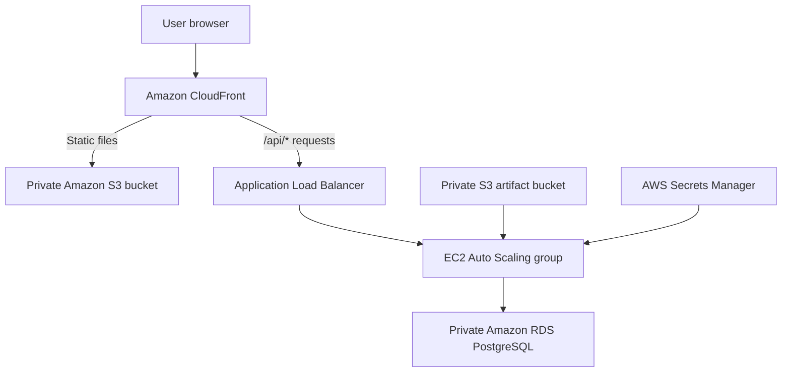

# Event Ticket Platform

A full-stack event ticket booking demo deployed on AWS with Terraform. The project demonstrates a production-inspired request path, automatic backend recovery and scaling, private database access, managed credentials, and repeatable infrastructure deployment.

> The live AWS environment is destroyed when not being demonstrated to avoid unnecessary charges. The application can be recreated from the Terraform configuration in this repository.

## Architecture



CloudFront is the public entry point. It serves the frontend from a private S3 bucket and forwards `/api/*` requests to the Application Load Balancer. The load balancer sends traffic only to healthy FastAPI instances in the Auto Scaling group. Application data is stored in a private PostgreSQL database on Amazon RDS.

## What the application does

- Lists upcoming events and remaining ticket inventory
- Creates bookings and generates unique booking references
- Calculates the total booking price in AED
- Prevents bookings for past events
- Prevents bookings when insufficient tickets remain
- Updates ticket inventory atomically to reduce overselling
- Retrieves bookings using a customer email address
- Exposes a health endpoint for load balancer checks

## AWS services

| Service | Purpose |
|---|---|
| Amazon CloudFront | Provides the public HTTPS endpoint and routes static and API traffic |
| Amazon S3 | Privately stores the frontend files and packaged backend artifact |
| Application Load Balancer | Distributes API requests and checks backend health |
| Amazon EC2 | Runs the FastAPI backend as a systemd service |
| EC2 Auto Scaling | Maintains the desired backend capacity and replaces unhealthy instances |
| Amazon RDS for PostgreSQL | Stores events, bookings, and ticket inventory |
| AWS Secrets Manager | Manages the RDS master password used during instance startup |
| AWS Systems Manager | Provides managed access to EC2 without opening SSH |
| IAM | Gives the backend only the AWS permissions required for startup |
| Amazon VPC | Separates public application components from the private database |
| Terraform | Defines and manages the complete AWS environment as code |

## Security design

- The frontend S3 bucket blocks public access and is reachable through CloudFront Origin Access Control.
- The ALB accepts inbound traffic only from the AWS-managed CloudFront prefix list.
- EC2 accepts backend traffic only from the ALB security group on port `8000`.
- RDS is not publicly accessible and accepts PostgreSQL traffic only from the EC2 security group.
- The database password is generated and managed by AWS instead of being committed to source control.
- EC2 uses an IAM role and Systems Manager; no inbound SSH rule is required.
- EC2 uses IMDSv2, encrypted EBS storage, and a non-login service account for the application.
- Terraform state, variable files, local databases, build artifacts, and environment files are excluded from Git.

## Technology stack

- **Frontend:** HTML, CSS, JavaScript
- **Backend:** Python, FastAPI, Uvicorn
- **Database:** SQLite for local development; PostgreSQL on Amazon RDS
- **Data layer:** SQLAlchemy and Pydantic
- **Infrastructure:** Terraform
- **EC2 operating system:** Amazon Linux 2023

## API endpoints

| Method | Endpoint | Purpose |
|---|---|---|
| `GET` | `/api/health` | Load balancer health check |
| `GET` | `/api/events` | List upcoming events |
| `POST` | `/api/bookings` | Create a ticket booking |
| `GET` | `/api/bookings?email=...` | Find bookings by email |

## Run locally

### 1. Create the Python environment

```bash
python3 -m venv .venv
source .venv/bin/activate
pip install -r backend/requirements.txt
```

### 2. Start the API

```bash
uvicorn app.main:app --app-dir backend --reload --port 8000
```

The backend uses `event_tickets.db` locally when `DATABASE_URL` is not set.

Test the API:

```bash
curl http://127.0.0.1:8000/api/health
curl http://127.0.0.1:8000/api/events
```

### 3. Start the frontend

In another terminal:

```bash
python3 -m http.server 5500 --directory frontend
```

Open [http://127.0.0.1:5500](http://127.0.0.1:5500).

## Deploy to AWS

### Prerequisites

- An AWS account and authenticated AWS CLI
- Terraform
- Python 3
- Permission to create the AWS resources defined under `infrastructure/`

Deployment creates billable resources, including an ALB, EC2 instance, RDS database, CloudFront distribution, and S3 buckets.

```bash
cd infrastructure
terraform init
terraform fmt -check
terraform validate
terraform plan -out=deploy.tfplan
terraform apply deploy.tfplan
terraform output -raw application_url
```

The EC2 launch template installs the backend automatically, downloads its packaged artifact from private S3, retrieves the managed database credentials, and starts Uvicorn through systemd.

## Destroy the demo

Destroy the environment after collecting demonstration evidence:

```bash
cd infrastructure
terraform plan -destroy -out=destroy.tfplan
terraform apply destroy.tfplan
```

Review the destroy plan before applying it. RDS is configured without a final snapshot because this repository represents a temporary demonstration environment, not a production workload.

## Repository structure

```text
.
├── backend/
│   ├── app/
│   │   ├── database.py
│   │   ├── main.py
│   │   ├── models.py
│   │   └── schemas.py
│   └── requirements.txt
├── frontend/
│   ├── app.js
│   ├── index.html
│   └── styles.css
└── infrastructure/
    ├── artifacts.tf
    ├── autoscaling.tf
    ├── cloudfront.tf
    ├── compute.tf
    ├── database.tf
    ├── frontend.tf
    ├── iam.tf
    ├── load_balancer.tf
    ├── network.tf
    ├── security.tf
    └── user_data.sh.tftpl
```

## Skills demonstrated

- Designing a multi-tier AWS architecture
- Routing frontend and API traffic through CloudFront
- Applying security-group-to-security-group access controls
- Running a Python service automatically on EC2
- Connecting application code to a private managed database
- Configuring load balancer health checks and Auto Scaling
- Managing infrastructure lifecycle and cost with Terraform
- Diagnosing EC2 startup failures through AWS Systems Manager
